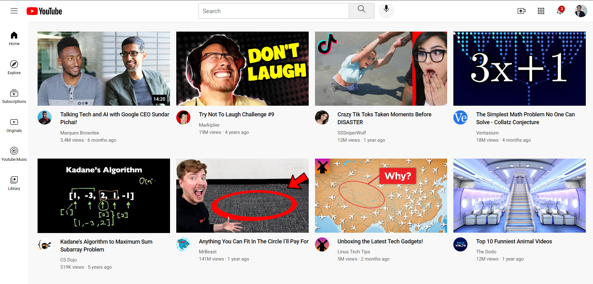
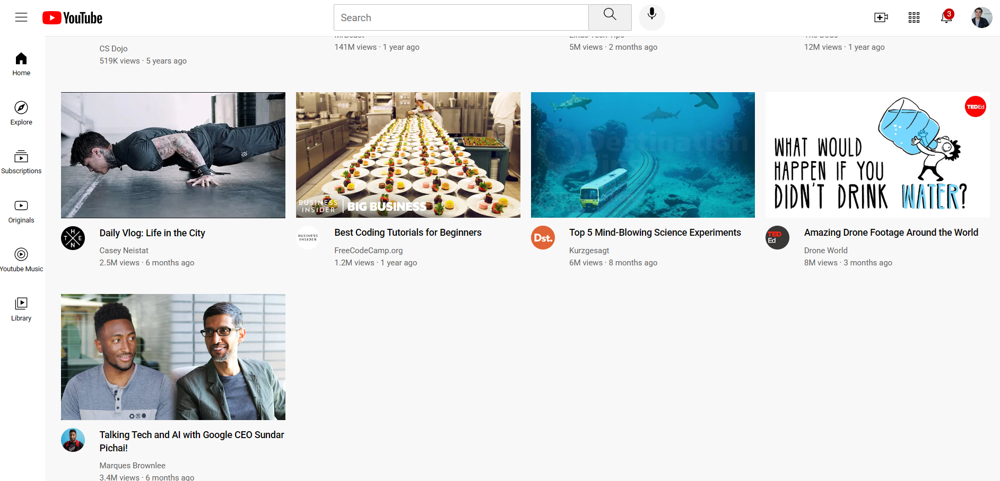
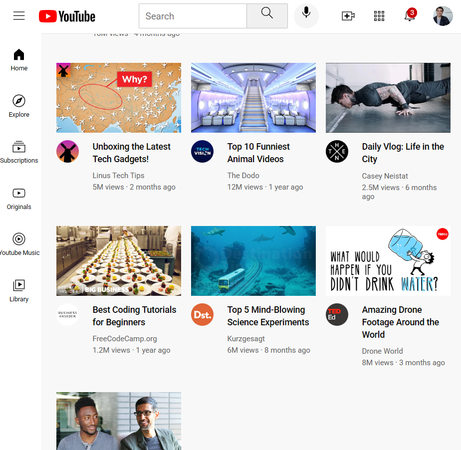

# YouTube Clone (HTML & CSS)

## About The Project
This is a front-end clone of YouTube built using only HTML and CSS.  
The project focuses on layout design, responsive structure, and UI replication.

## Features
- Responsive navigation bar  
- Video grid layout  
- Sidebar menu  
- Clean UI similar to YouTube  

## Built With
- HTML5  
- CSS3  

## Screenshots

  

  

  

## Purpose
Built to strengthen my front-end development skills and understand real-world UI structuring.

## Future Improvements
- Add JavaScript functionality  
- Implement search feature  
- Improve mobile responsiveness  
